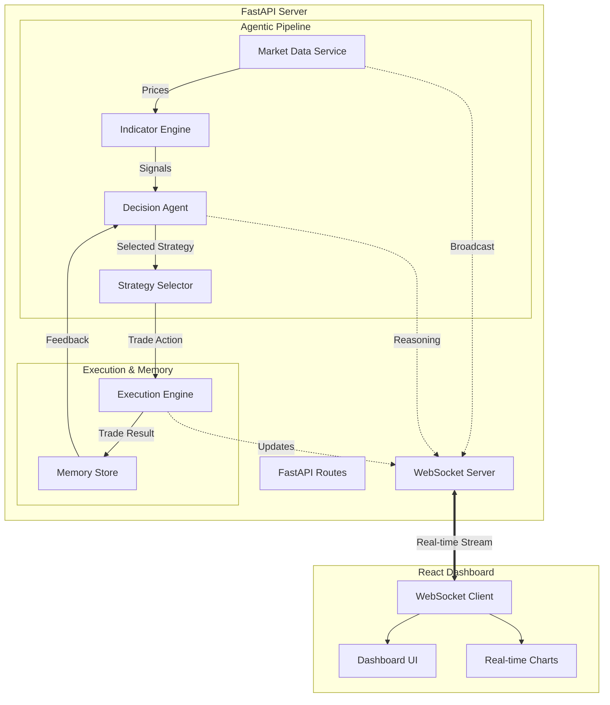

# CryptoPilot AI: System Architecture

The following diagram illustrates the agentic pipeline and data flow of the CryptoPilot AI system.

## Component Breakdown

### 1. Agentic Pipeline
- **Market Data Service**: Simulates or fetches live crypto prices.
- **Indicator Engine**: Extracts technical features like RSI, MACD, and Volatility.
- **Decision Agent**: The brain of the system. Evaluates indicators and selects the optimal strategy.
- **Strategy Selector**: Executes specific logic (RSI-based, DCA, or Trend Following).

### 2. Execution & Memory
- **Execution Engine**: Manages virtual wallet, calculates PnL, and handles order simulation.
- **Memory Store**: Persists trade history and provides the data necessary for the agent's feedback loop.

### 3. Frontend Dashboard
- A high-fidelity React interface that visualizes the agent's "thought process" and portfolio performance in real-time.
